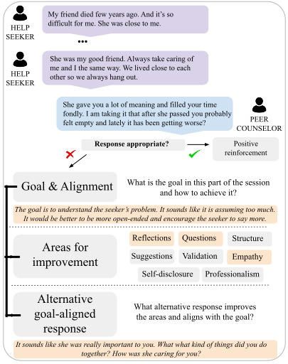

## Multi-Level Feedback Generation with Large Language Models for Empowering Novice Peer Counselors

<p align="center">
  
</p>

### FeedbackESConv Dataset

You can find the dataset here: [FeedbackESConv](https://huggingface.co/datasets/SALT-NLP/feedback_qesconv)


To see FeedbackESConv dataset statistics (Table 2), run:
```
poetry run python dataset_stats.py
``` 

Our dataset builds on ESConv dataset - https://github.com/thu-coai/Emotional-Support-Conversation

```
@inproceedings{liu-etal-2021-towards,
  title={Towards Emotional Support Dialog Systems},
  author={Liu, Siyang  and 
    Zheng, Chujie  and 
    Demasi, Orianna  and 
    Sabour, Sahand  and 
    Li, Yu  and 
    Yu, Zhou  and 
    Jiang, Yong  and 
    Huang, Minlie},
  booktitle={ACL},
  year={2021}
}
```


### GPT-4 based pre-annotation


You can find prompt for GPT-4 based annotation in `prompts` directory. Instruction details based on the feedback framework can be found in `prompt_gpt_instruction.txt` whereas exemplars are in `prompt_gpt_input_prefixt.txt`.

For details on `GPT-4` annotation please refer to `gpt_annotation.py` file and for details on data processing to `utils.py`. Currently by default `gpt-4` points to `gpt-4-0631` model version. We set temperature to 0.8.

### Models

To run our model on test set go to `model_training` and run:

```
poetry run accelerate launch generate.py --dataset_name="feedback_qesconv"
```

Example generation:
```
### Input:
Seeker: I'm okay i guess. How are you?
Helper: I'm pretty good, I can't complain. Is there any thing going on with your life that you would like to discuss?
Seeker: My marriage recently fell apart and i had to relocate to NC with my children. That's going as well as you would th
ink it is.
Helper: I know separation isn't easy, especially with children involved. How are you coping with this transition?
Seeker: I guess im okay, a little shaky and still find myself in tears from time to time. Honestly it is nothing new for m
e. I've suffered from depressions since i was a young teen
Helper: Well breakup is not easy so what you're feeling is normal. Have you ever sought out professional help for depressi
on?
Seeker: Yes I go to the local mental health. I'm actually bipolar 1 which kinda makes my depression a little worse. I see
a counselor twice a month. I still however have some trouble in between visits. I just can not afford to be seen more ofte
n.
Helper: Are there hobbies or activities that you do that help you cope with issues such as jogging, reading, etc.?

### Response:

{'perfect': False, 'goodareas': [], 'feedback': "The goal is to provide emotional support and help the seeker feel underst
ood. It would be better to empathize with the seeker's situation before suggesting a coping strategy.", 'badareas': ['Empa
thy', 'Suggestions'], 'alternative': "It sounds like you're really trying to manage your depression and it's not easy. It'
s great that you're seeing a counselor regularly. Can you tell me more about the strategies you're currently using to cope
?"}

```

#### Risk disclosure
The model is experimental and has been evaluated only on a set of in-domain emotional support conversations (ESConv). Use with caution and at your own risk. The generated feedback can be inappropriate and it is therefore important to treat model-generated advice only as potential guidance and discard it if necessary. Any potential user should be aware of the limitations and risks associated with using the model. 
This model was created for research purposes and should not be regarded as a substitute for expert feedback. The model behaviour should be closely monitored to determine its suitability and detect potential problematic behaviours.

To reproduce model comparison plot (Figure 3) run:
```
poetry run python plot_scores.py
```

To reproduce model training please refer to details in README.md in `model_training` directory.


